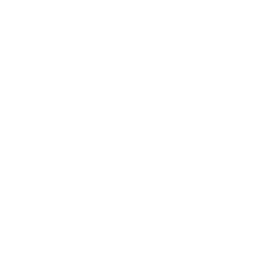

# Flex desks occupancy app

## The app

The app is a tool that can help employees determine if they want to work from home or go to the office based on the availability of a working space. The app shows the number of desks available vs the number of people that are expected to go to the office based on the calendars of these people. 

## Main functions

- Gather calendars from google and Outlook that are associated with the user.
- Parse these calendars and find any events that match the search terms. 
- Store the dates of the positive matches.
- Use the number of positive matches per date as a indication for the number of people that are not going to the office on that day.
- If the user with a positive match on that date has a fixed desk then increase the number of available desk.

- Custom calendar within the app to quickly change user status.

## Gather and parsing the calendars
Most calendar apps allow the user to share their calendar. I'm using this functionality to get acces and get the data that I need. I store the calendar urls in a sql database. Using php I loop through all the users urls and see if there are any positive matches.
The function below is the start of the search through the calendar.
This php function takes 4 arguments:

- $row = the sql info from one user
- $conn = the sql connection
- $currentShortDate = date that we are searching
- $searchArray = the search terms


The function  loops through all the urls that belong to the user. On each Url it first finds the events on a date and stores them in a array. The searchCalendar function then searches through all the found events for the search terms. If a postive has been found it return a 1. It inserts the date in the customcal Database and the function stops and return a 1. The 1 is subtracted from the number of people comming or if a fixed desk gets added to the number of desk 

```
function searchOneUserCalendar($row, $conn , $currentShortDate , $searchArray) {
  $sql2 = "SELECT url FROM `calendars` WHERE deskuser_id = ".$row["deskuser_id"] ." ";//get urls that belong to this user
  $result2 = $conn->query($sql2);
  if ($result2->num_rows > 0) { //loop through arrays
    // output data of each row
    while($row2 = $result2->fetch_assoc()) {

        $ical   = new ICal($row2["url"]);
        $events = $ical->events();

      $datePositions = findEventsWithDate($events, $currentShortDate); // find all events with the date

      $posPerCal = searchCalendar($datePositions,$events,$searchArray); // return number of positves in one calendar

      if ($posPerCal>0) {//if terms have been found
      	insertIntoCustomCal($conn,$row["deskuser_id"],0,$currentShortDate);
        return $posPerCal;
      }
      
    } 
  }
}
```   

$numberOfPeople is the total number of user so the code runs when users exist. From here the above function is called for each user. 
```
if ($numberOfPeople > 0) {
  // output data of each row
  while($row = $result->fetch_assoc()) { //users
    if ($row["defaultpresent"]==1) { // desk user is normaly present
      $positves = 0 ;

      $posPerCal = searchOneUserCalendar($row, $conn,$currentShortDate,$searchArray);
      if ($posPerCal>0) {
        $positves+=1; //add 1 to positive per user per cal
      }
      if ($row["fixed"] == 1) {
        $numberOfPeople-=1;
      }
      if ($positves>0 && $row["fixed"] == 0) { //user cal contains positives so min one to the number of people comming
        $numberOfPeople-=1;
      } else if ($positves>0 && $row["fixed"] == 1) {

        $fixexdeskNotPresent +=1;
      }
    } else { //deskuser is not normaly present
      $numberOfPeople-=1;
    }
      
  }
}
```

### Cronjob

I use a cronjob to run the parse calender functionality every 30 minutes. In this way the long time it takes to excute the code is not a problem for the user.

## Showing the result

I retrieve the data from a sql database and generate the content based on this data using php.
below is a example of how I retrieve the result for occupency.
```
function getOccupencyResults ($conn,$currentShortDate) {
    $resultdate = date("Y-m-d",strtotime($currentShortDate));
    $num = getCustomCalResult ($conn,$resultdate);
    
    $resultdesk=array();
    $sql = "SELECT * FROM `occupancy_results` WHERE resultdate = '".$resultdate."'";
    $result = $conn->query($sql);
    while($row = $result->fetch_assoc()) {

      array_push($resultdesk, $row['desk'],$row['people']-=$num);
      return $resultdesk;
    }

}
```

## Custom calendar
In my custom calendar I only want to show the work days as the weekend is useless. I start by getting the date from the last sunday and from there loop through a specified number of weeks where it generates the html for every workday with date and results.

```
  function loopThroughWeeks ($weeks,$conn) {
    $currentWeek = strtotime('previous Sunday');
    $today = strtotime('today');
    $result = "";
    //$week = 0;
    for ($i=0; $i < $weeks; $i++) {
      $result = $result . "<div class='weeknumber'><span> Week: ".date('W',strtotime('+'.$i.' week', $today))."</span></div>";
      $result = $result .  createWeekdays(strtotime('+'.$i.' week', $currentWeek),$conn);
    }
    return $result;
  }

  function createWeekdays($sundayTimeStamp,$conn) {
    $timestamp = $sundayTimeStamp;
      //$days = array();strtotime('previous Sunday');
    $action =  htmlspecialchars($_SERVER["PHP_SELF"]);
    $result = "";
    $numberOfDesk=0;
    $numberOfPeople=0;

    for ($i = 0; $i < 5; $i++) {
      $className="";
      $img="";
      //checkCustomCalendar($conn,$user);
      
        //$days[] = strftime('%A', $timestamp);
      $timestamp = strtotime('+1 day', $timestamp);
      if ($timestamp==strtotime('today')) {
        $className="today";
      } else if ($timestamp<strtotime('today')) {
        $className="past";
      }
      if(checkCustomCalendar($conn,$timestamp)) {
        $img="desk.svg";
        $className=$className." emptydesk";
      } else {
        $img="deskperson.svg";
      }
      
      $resultDeskOccupency = getOccupencyResults($conn,date("Ymd",$timestamp));
      $numberOfPeople=$resultDeskOccupency[1];
      $numberOfDesk=$resultDeskOccupency[0];
      $divId = "d".date('d-m',$timestamp);

      $result = $result . "<div id='$divId' class='".$className."'>            
        <form method='post' action=".$action.">
          <span>".date('d-m',$timestamp)."</span>
          
          <input type='hidden' name='date' value=".$timestamp.">
          <button type='submit' name='changeGoingOffice' value='change'></button>
        </form>
        <div class='deskvsemployee'>
          <div class='desk'><span>$numberOfDesk - </span></div>
          <div class='employee'><p><span>$numberOfPeople</span> - </p></div>
        </div>
      </div>";
    }
    return $result;
  }
```